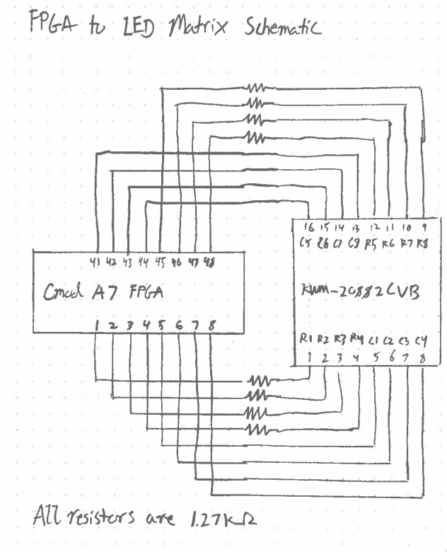

# Conway's Game of Life

Devlin Ih, Arturo Joya

Olin College Computer Architecture Fall 2022

# Documentation

Notebook, whiteboard sketches, and a video can be found in `docs/`.

# Verilog 

Hardware implementation of Conway's Game of Life is located in `hdl/`, tests
are located in `tests/`.

# Hardware

- [Cmod A7 FPGA Reference](https://digilent.com/reference/programmable-logic/cmod-a7/reference-manual)
- [8x8 LED Display Datasheet](https://cdn-shop.adafruit.com/datasheets/454datasheet.pdf) 
- 1.27 kΩ resistors.

Here is the wiring diagram:

