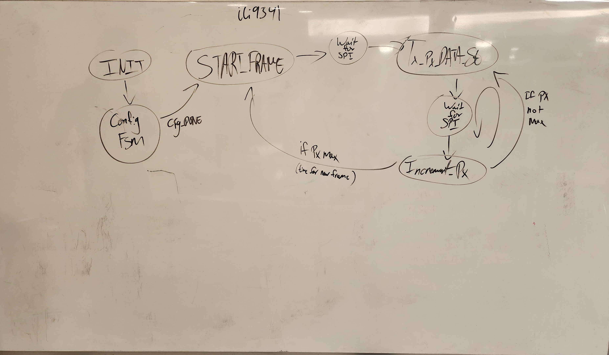

# Written Portion of Lab Report
Contributors: Devlin Ih, Arturo Joya

## Learning from Professional Code:

### `ili9341_display_controller.sv`
The ili9341 chip communicates via SPI protocol which follows a handshake transaction. The ili9341 display controller has two state machines; the main state machine that is in charge of sending the data to the screen, and a sub state machine in the intitializing state that configures the data from the ROM.

The main state machine has 6 states - the initializing state (`INIT`), the finding-the-pixel-to-write-to (`INCREMENTING_PIXEL`) state, the ready-to-create-the-image (`START_FRAME`) state, the begin-sending-pixel-data (`TX_PIXEL_DATA_START`) state, the I'm-in-the-middle-of-sending-data (`TX_PIXEL_DATA_BUSY`) state, and an idle (`WAIT_FOR_SPI`) state. There is also an `ERROR` state that is used primarily for debugging the system.

#### Main FSM
The INIT state is in charge of configuring how the data packets are supposed to be sent to the screen based on the block rom. This configuration sequence is itself another FSM which will be described after this one. Once the configurations are done, the next step is to create the image (`START_FRAME`)

In the `START_FRAME` state, we essentially declare that we are ready to start creating the image. We still need to wait for the SPI, so we set our state to wait for the SPI. However, we also set a `state_after_wait` which is essentially what we will do after waiting for the SPI. In this case, we are essentially going from 'ready to create the image' to 'start creating the image' (`TX_PIXEL_DATA_START`).

The `WAIT_FOR_SPI` state does nothing until the SPI is ready to recieve data (when `i_ready` turns high).

The `TX_PIXEL_DATA_START` begins the transmission of data. Similarly to `START_FRAME`, we must wait for the SPI, so we set the state to `WAIT_FOR_SPI`. However, unlike `START_FRAME`, once the SPI confirms that it is ready to receive data, we will instead update the pixel that we will be writing to (`INCREMENTING_PIXEL`)

The `INCREMENTING_PIXEL` loops through the pixels by sweeping the x axis for every y axis - increasing the y axis once the x axis had been sweeped. Note every time we enter this stage, we only increase by 1 pixel. As long as the pixels have not been maxed out, we have to go back to `TX_PIXEL_DATA_START` so we can transmit the data of a new (the next) pixel. Once the max pixel has been reached, then it is time to go to a new frame. Thus, once the last x and y pixels have been written, they are then both set to 0, and the next state becomes `START_FRAME`.

We don't really understand the `TX_PIXEL_DATA_BUSY` here since we dont see this state ever being called.

### `ft6206_controller.sv`
The ft6206 chip communicates via i2c protocol which also follows a handshake protocol; however, the communication is two-way at all times. This controller works on an 8 state FSM that has he following states: the idle state (`IDLE`), the initializing state (`INIT`), the waiting-for-i2c-to-write (`WAIT_FOR_I2C_WR`), the waiting-for-i2c-to-read (`WAIT_FOR_I2C_RD`), the setting-touch-threshold (`SET_THRESHOLD_REG` & `SET_THRESHOLD_DATA`) states, the detect touch (`TOUCH_START`) state, the get-register-and-its-data-based-on-touch (`GET_REG_REG`, & `GET_REG_DATA`, & `GET_REG_DONE`) states, the TOUCH_DONE state, and an `ERROR` state used for debugging purposes.

#### Main FSM
The `INIT` state is called to initialize the controller, which pulls the information for the touch sensitivity by transitioning to the `SET_THRESHOLD_REG` state.

The `SET_THRESHOLD_REG` state sets `i_valid` and loads `i_data` with the `THRESHOLD` information, which is esentially the sensitivity for each touch.

The `SET_THRESHOLD_DATA` state also sets `i_valid`, and loads `i_data` with the default threshold. In this state, we also set the next state after waiting for the i2C, to go to idle. After this, these states no longer get called.

The `IDLE` state waits for `i_ready` and `ena` to be high before doing anything. Once both are high, the `TD_STATUS` register becomes active, and sets the next state to `GET_REG_REG`.

The `GET_REG_REG` state sets `i_valid` and loads `i_data` with the address of the active registrer, which could be `TD_STATUS`, `P1-XH`, `P1-XL`, `P1-YH`, `P1-YL`. We have to wait for the i2c, so transition to the `WAIT_FOR_I2C_WR` (since we are essentially waiting for i2c to write this data), but then afterwards we will transition to `GET_REG_DATA`.

At the `GET_REG_DATA` state, we set `i_valid`, and make the `i2c_mode` read 8 bits, which is the information carried by the register we assigned in the `GET_REG_REG` state.

The `GET_REG_DONE` state handles the data received from the active registers, this being the validity of a detected touch, whether or not there was an event located at a coordinate (H), or the x,y coordinate location (L). Once the `P1-YL` register is reached, we will pack the information onto touch0 so that it can be interpreted externally. Until the `P1-YL` register is reached, this state will update the `active_register` to the next register in line and will transition to `GET_REG_REG` to get all of the data.

The `TOUCH_DONE` state handles the data formatted by `GET_REG_DONE` to fit the struct such that it can be interpreted by the VRAM when it gets sent through the i2c protocol

The `WAIT_FOR_I2C_WR` waits for `i_ready` before transitioning, and the `WAIT_FOR_I2C_RD` waits for `i_ready` and `o_ready` to before transitioning states. Both set `i_valid` to 0.
